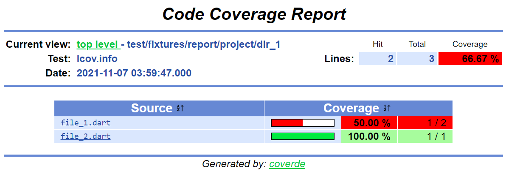
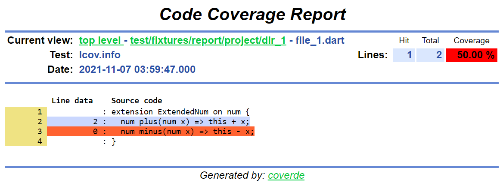

# Coverde

[![pub package][pub_badge]][pub_link]
[![License: MIT][license_badge]][license_link]
[![Dart CI][dart_ci_badge]][dart_ci_link]
[![codecov][codecov_badge]][codecov_link]
[![style: very good analysis][very_good_analysis_badge]][very_good_analysis_link]
[![melos][melos_badge]][melos_link]

A CLI for basic coverage trace files manipulation.

---

# Index

- [Installing](#installing)
- [Features](#features)
- [Usage with `melos`](#usage-with-melos)
- [CI integration for coverage checks](#ci-integration-for-coverage-checks)

---

# Installing

You can make `coverde` globally available by executing the following command:

```sh
$ dart pub global activate coverde
```

**NOTE:** To run `coverde` directly from the terminal, add the system cache `bin` directory to your `PATH` environment variable.

---

# Features

- [**Check coverage value computed from a trace file**](#coverde-check)
- [**Filter the tested files included in a trace file**](#coverde-filter)
- [**Remove a set of files and folders**](#coverde-remove)
- [**Generate HTML coverage report**](#coverde-report)
- [**Compute and display the coverage value from a trace file**](#coverde-value)

## `coverde check`

**Check coverage value computed from a trace file.**

### Parameters

|      Order       | Description                                                             | Required |
| :--------------: | ----------------------------------------------------------------------- | :------: |
| Unique parameter | An integer between 0 and 100 used as minimum acceptable coverage value. |    ✔     |

### Options

|      Option       | Description                             |    Default value     |
| :---------------: | --------------------------------------- | :------------------: |
| `--input`<br>`-i` | Trace file used for the coverage check. | `coverage/lcov.info` |

### Flags

| Flag                                                               | Description           | Default value |
| ------------------------------------------------------------------ | --------------------- | :-----------: |
| Enable:<br>• `--verbose`<br>• `-v`<br>Disable:<br>• `--no-verbose` | Print coverage value. |   _Enabled_   |

### Examples

- `coverde check 90`
- `coverde check 75 -i lcov.info`
- `coverde check 100 --no-verbose`

## `coverde filter`

**Filter the tested files included in a trace file.**

### Options

|       Option        | Description                                                                                                               |         Default value         |
| :-----------------: | ------------------------------------------------------------------------------------------------------------------------- | :---------------------------: |
|  `--input`<br>`-i`  | Coverage trace file to be filtered.                                                                                       |     `coverage/lcov.info`      |
| `--output`<br>`-o`  | Filtered coverage trace file (automatically created if it is absent).                                                     | `coverage/filtered.lcov.info` |
| `--filters`<br>`-f` | Set of comma-separated patterns of the files to be opted out of coverage.                                                 |                               |
|  `--mode`<br>`-m`   | The mode in which the filtered trace file content should be generated.<br>`a`: append content.<br>`w`: overwrite content. |     `a` (append content)      |

### Examples

- `coverde filter`
- `coverde filter -f \.g\.dart`
- `coverde filter -f \.freezed\.dart -mode w`
- `coverde filter -o coverage/tracefile.info`

## `coverde remove`

**Remove a set of files and folders.**

### Flags

| Flag                                                                   | Description                                                                                                                                                              | Default value |
| ---------------------------------------------------------------------- | ------------------------------------------------------------------------------------------------------------------------------------------------------------------------ | :-----------: |
| Enable:<br>• `--accept-absence`<br>Disable:<br>• `--no-accept-absence` | Set the command behavior according to a file/folder existence.<br>If enabled, the command continues and notifies the element absence.<br>If disabled, the command fails. |   _Enabled_   |

### Examples

- `coverde remove file.txt`
- `coverde remove path/to/folder/`
- `coverde remove path/to/another.file.txt path/to/another/folder/ local.folder/`

## `coverde report`

**Generate HTML coverage report.**

### Options

|       Option       | Description                                                         |    Default value     |
| :----------------: | ------------------------------------------------------------------- | :------------------: |
| `--input`<br>`-i`  | Coverage trace file to be used as source for report generation.     | `coverage/lcov.info` |
| `--output`<br>`-o` | Destination folder where the generated report files will be placed. |   `coverage/html/`   |
|     `--medium`     | Medium threshold for coverage value.                                |          75          |
|      `--high`      | High threshold for coverage value.                                  |          90          |

The report style is dynamically set according to individual, group and global coverage and the `--medium` and `--high` options.

### Examples

- `coverde report`
- `coverde report -i coverage/tracefile.info --medium 50`
- `coverde report -o coverage/report --high 95`

### Results





## `coverde value`

**Compute and display the coverage value from a trace file.**

### Options

|      Option       | Description                                                    |    Default value     |
| :---------------: | -------------------------------------------------------------- | :------------------: |
| `--input`<br>`-i` | Coverage trace file to be used for coverage value computation. | `coverage/lcov.info` |

### Flags

| Flag                                                               | Description                                                           | Default value |
| ------------------------------------------------------------------ | --------------------------------------------------------------------- | :-----------: |
| Enable:<br>• `--verbose`<br>• `-v`<br>Disable:<br>• `--no-verbose` | Print coverage value for each source file included by the trace file. |   _Enabled_   |

### Examples

- `coverde value`
- `coverde value -i coverage/tracefile.info --no-verbose`

---

# Usage with [melos][melos_link]

If your project uses melos to manage its multi-package structure, it could be handy to collect test coverage data in a unified trace file.

This can be achieved by defining a melos script as follows:

```yaml
M:
  description: Merge all packages coverage tracefiles ignoring data related to generated files.
  run: >
    coverde rm MELOS_ROOT_PATH/coverage/filtered.lcov.info &&
    melos exec --file-exists=coverage/lcov.info -- coverde filter --input ./coverage/lcov.info --output MELOS_ROOT_PATH/coverage/filtered.lcov.info --filters \.g\.dart
```

`M` is the melos script that merges the coverage trace file of all tested packages contained within the project

This melos script ignores generated source files with the `.g.dart` extension but this behavior could be adjusted by setting the `--filters` option.

The resulting trace file is the `filtered.lcov.info` file, located in the `coverage` folder in the root folder of the project.

---

# CI integration for coverage checks

If your project uses GitHub Actions for CI, you might already know [very_good_coverage][very_good_coverage_link], which offers a simple but effective method for coverage validation.

However, adding coverage checks to CI workflows hosted by other alternatives is not always that straightforward.

To solve this, after enabling Dart or Flutter in your CI workflow, according to your project requirements, you can use `coverde` and its `check` tool by adding the following commands to your workflow steps:

- `dart pub global activate coverde`
- `coverde check <min_coverage>`

# Bugs or Requests

If you encounter any problems or you believe the CLI is missing a feature, feel free to [open an issue on GitHub][open_issue_link].

Pull request are also welcome. See [CONTRIBUTING.md](CONTRIBUTING.md).

[codecov_badge]: https://codecov.io/gh/mrverdant13/coverde/branch/main/graph/badge.svg
[codecov_link]: https://codecov.io/gh/mrverdant13/coverde
[dart_ci_badge]: https://github.com/mrverdant13/coverde/workflows/Dart%20CI/badge.svg
[dart_ci_link]: https://github.com/mrverdant13/coverde/actions?query=workflow%3A%22Dart+CI%22
[license_badge]: https://img.shields.io/badge/license-MIT-blue.svg
[license_link]: https://opensource.org/licenses/MIT
[melos_badge]: https://img.shields.io/badge/maintained%20with-melos-f700ff.svg
[melos_link]: https://github.com/invertase/melos
[open_issue_link]: https://github.com/mrverdant13/coverde/issues/new
[pub_badge]: https://img.shields.io/pub/v/coverde.svg
[pub_link]: https://pub.dev/packages/coverde
[very_good_analysis_badge]: https://img.shields.io/badge/style-very_good_analysis-B22C89.svg
[very_good_analysis_link]: https://pub.dev/packages/very_good_analysis
[very_good_coverage_link]: https://github.com/VeryGoodOpenSource/very_good_coverage
